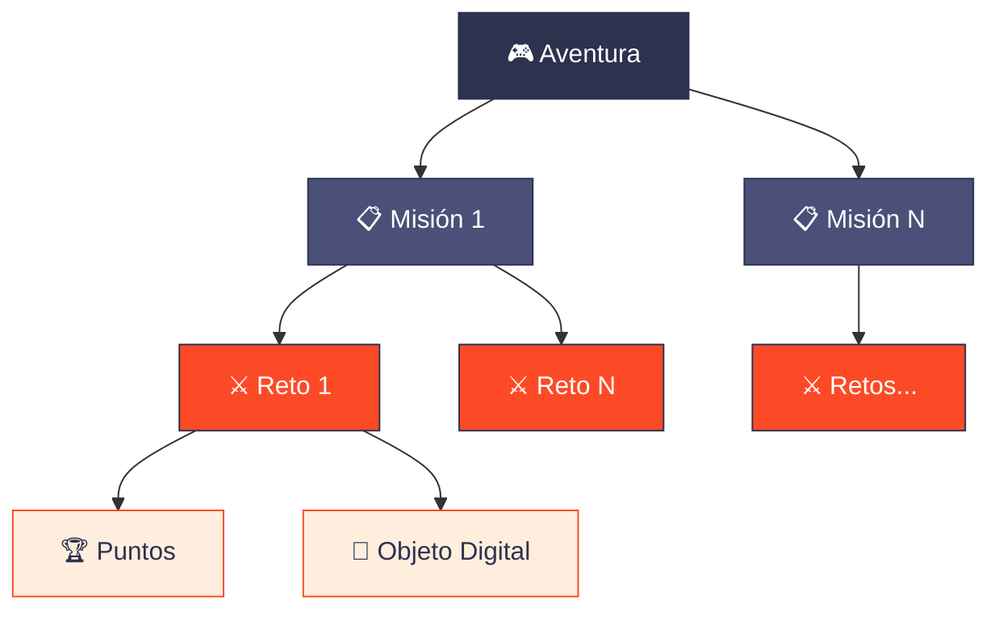

# ¿Qué es AdventuriQ?

:::info 🌐 Quién puede leer esto
**Todos los roles**: Game Master, Game Designer y Player.
:::

AdventuriQ es una plataforma tecnológica de **Gamificación** que permite crear **Aventuras** usando mecánicas y componentes de juego. Los participantes juegan desde un navegador web en sus móviles, tablets u ordenadores — sin necesidad de instalar nada.

Con AdventuriQ puedes diseñar experiencias interactivas completas: desde yincanas turísticas hasta formaciones corporativas gamificadas, pasando por eventos de team building o actividades educativas.

## Los cuatro roles

Dependiendo de lo que necesites hacer, usarás AdventuriQ con uno de estos roles:

| Icono | Rol | Qué hace | Accede a |
|---|---|---|---|
| 👑 | **Game Master** | Compra licencias y tokens, crea Aventuras, gestiona Game Designers | Gamifier |
| 🛠️ | **Game Designer** | Diseña y configura Aventuras bajo supervisión de un Game Master | Gamifier |
| 🎮 | **Player** | Juega las Aventuras | Webapp |

:::tip
Si acabas de llegar, lo más probable es que seas **Game Master** (creas tus propias Aventuras) o **Player** (juegas Aventuras que otros han creado).
:::

## Las dos partes de AdventuriQ

AdventuriQ se compone de dos aplicaciones web:

| Componente | URL | Para quién | Descripción |
|---|---|---|---|
| **Gamifier** | [gamifier.adventuriq.com](https://gamifier.adventuriq.com) | Game Master / Game Designer | Administrador de contenidos donde se crean y configuran las Aventuras |
| **Webapp** | [webapp.adventuriq.com](https://webapp.adventuriq.com) | Player | Progressive Web App donde los jugadores participan en las Aventuras |

### Gamifier — donde se crean las Aventuras

Desde el Gamifier, el Game Master y el Game Designer diseñan toda la experiencia: crean Aventuras, organizan Misiones, configuran Retos y asignan recompensas. Se puede usar desde escritorio, tablet o móvil.

### Webapp — donde se juegan las Aventuras

La Webapp es la aplicación que usan los Players. Desde ahí acceden a las Aventuras, completan Retos, acumulan puntos y consultan su progreso en la Bitácora.

## La jerarquía: Aventura → Misión → Reto

Toda experiencia en AdventuriQ sigue una estructura jerárquica de tres niveles:

- **Aventura**: la experiencia gamificada completa. Es lo que el Player ve y juega.
- **Misión**: una agrupación temática de Retos dentro de la Aventura. Permite organizar el contenido por fases o temas.
- **Reto**: la prueba individual que el Player debe superar. Puede ser una pregunta, una foto, un QR, una respuesta libre y más.
- Al completar Retos, el Player obtiene **Puntos**, **Objetos Digitales** (pistas, badges, códigos…) y otras recompensas.

## Casos de uso

AdventuriQ se adapta a múltiples contextos. Estos son los más habituales:

| Caso de uso | Ejemplo |
|---|---|
| **Turismo** | Yincanas urbanas, rutas culturales gamificadas, escape rooms al aire libre |
| **Team Building** | Dinámicas de equipo con retos colaborativos y clasificación en tiempo real |
| **Educación** | Micro-aprendizaje interactivo, evaluaciones gamificadas, gymkanas escolares |
| **Eventos corporativos** | Actividades para congresos, ferias o convenciones con engagement digital |
| **RRHH y Onboarding** | Procesos de incorporación gamificados, formaciones internas interactivas |

## Cómo usar este manual

Este manual te guiará por todas las funcionalidades de AdventuriQ. Algunos consejos para aprovecharlo al máximo:

- **Tenlo a mano** mientras navegas por el Gamifier o juegas en la Webapp.
- Cada página indica con un icono **quién puede hacer lo que se describe** (👑 Game Master, 🛠️ Game Designer, 🎮 Player).
- Usa el **buscador** de la barra superior para encontrar cualquier tema rápidamente.
- Recuerda hacer clic en **Guardar** cada vez que modifiques algo en el Gamifier.
- Sigue el orden del menú lateral para una lectura progresiva, o salta directamente al tema que necesites.

:::tip ¿Primera vez?
Te recomendamos empezar por [Conceptos básicos](conceptos-basicos) para entender la estructura de Aventuras, Misiones y Retos antes de lanzarte a crear.
:::
