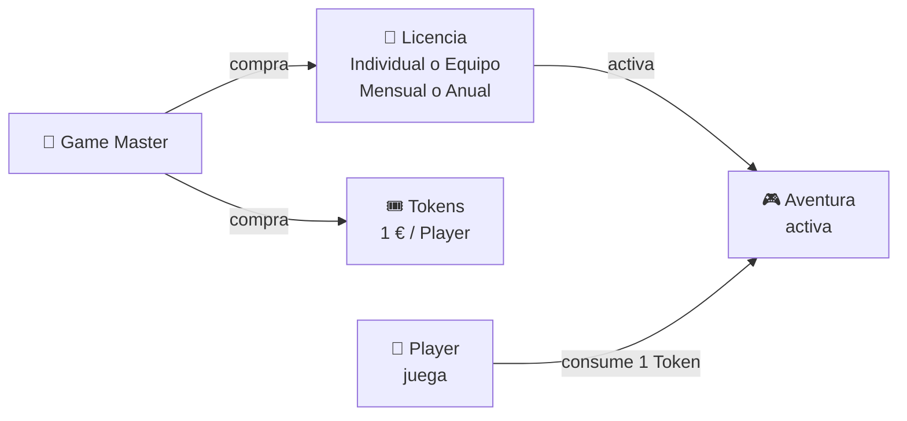

# 🪙 Tokens y Licencias

:::info 👑 Quién necesita leer esto
**Game Master** — esta página te ayuda a entender el modelo económico de AdventuriQ para presupuestar tus Aventuras.
:::

AdventuriQ funciona con un modelo sencillo y transparente basado en dos elementos: **Licencias** (para crear Aventuras) y **Tokens** (para que los Players jueguen). Aquí tienes todo lo que necesitas saber para planificar tu inversión.

## 💡 La economía de AdventuriQ en 30 segundos

El modelo económico de AdventuriQ se resume en dos pasos: el Game Master adquiere una Licencia para activar su Aventura y compra los Tokens que necesita para sus Players. Cada Player consume un Token al iniciar su partida.

*Precios sin impuestos. Los impuestos aplicables se calculan durante el proceso de compra según la legislación vigente y el país de facturación.*

## 📄 Licencias de Aventura

Una **Licencia** es lo que activa tu Aventura en la plataforma. Sin ella, la Aventura permanece en estado Draft y no es accesible para los Players.

AdventuriQ ofrece cuatro tipos de Licencia por Aventura, según el **modo de juego** (individual o equipo) y la **duración** (mensual o anual):

| Tipo | Precio | Duración | Modo de juego | Rankings disponibles |
|---|---|---|---|---|
| **Licencia Mensual (individual)** | 18 € / mes | 30 días desde la publicación | Individual | Ranking de jugadores |
| **Licencia Mensual (equipo)** | 36 € / mes | 30 días desde la publicación | Equipo | Ranking de jugadores + ranking por equipos |
| **Licencia Anual (individual)** | 200 € / año | 12 meses desde la publicación | Individual | Ranking de jugadores |
| **Licencia Anual (equipo)** | 400 € / año | 12 meses desde la publicación | Equipo | Ranking de jugadores + ranking por equipos |

La elección entre **Individual y Equipo** se hace en el momento de [crear la Aventura](aventuras/crear-aventura) y determina si los Players compiten solo a nivel individual o también agrupados en equipos (clanes). Con una Licencia de Equipo, además del ranking individual, se generan rankings por equipo y del jugador dentro de su equipo.

:::tip 🕐 La caducidad empieza cuando publicas, no cuando compras
Puedes comprar tu Licencia hoy y tomarte los días o semanas que necesites para construir tu Aventura. El contador solo empieza a correr en el momento en que **publicas la Aventura** y los Players pueden empezar a jugarla. Sin prisas, sin presión temporal durante la creación.
:::

### ¿Qué pasa cuando caduca una Licencia?

Cuando una Licencia vence, la Aventura deja de ser accesible para los Players. La **configuración y el contenido se mantienen intactos** — solo tienes que activar una Licencia nueva para que vuelva a ser jugable.

:::info
El sistema notifica al Game Master con antelación antes de la caducidad, para que puedas renovar sin interrupciones.
:::

La Licencia se gestiona desde la [configuración de la Aventura](aventuras/configuracion) en el Gamifier.

:::tip ¿Cómo elegir tu Licencia?
- **Individual** si cada Player compite por separado. **Equipo** si quieres que los Players jueguen agrupados en equipos (clanes) con ranking por equipo.
- **Mensual** si tu Aventura dura 1-3 meses: máxima flexibilidad, pagas solo por lo que usas.
- **Anual** si tu Aventura va a estar activa 4 meses o más: te ahorras la gestión de renovaciones y optimizas coste.
- **[Planes Luna o Mundo](#-alternativa-planes-anuales)** si necesitas Players ilimitados, varias Aventuras o quieres branderizar la experiencia con tu identidad visual.
:::

## 🎟️ Tokens de juego

Un **Token** es el ticket de entrada de cada Player a una Aventura. Cada vez que un Player inicia una partida nueva, consume un Token.

| Aspecto | Detalle |
|---|---|
| **Precio** | 1 € por Token |
| **Quién lo consume** | El Player, al pulsar "Adelante" para iniciar la Aventura |
| **Cuándo se consume** | Una vez por partida nueva |

### Ejemplo concreto

Imagina que quieres lanzar una Aventura de team building para 30 personas **en modo individual**. Según la duración y el uso, estas son las tres configuraciones típicas:

**Escenario A — Evento puntual (1 mes):**

| Concepto | Unidades | Coste |
|---|---|---|
| Licencia Mensual (individual) | 1 | 18 € |
| Tokens para Players | 30 | 30 € |
| **Total** | | **48 €** |

**Escenario B — Campaña de 3 meses:**

| Concepto | Unidades | Coste |
|---|---|---|
| Licencia Mensual (individual) × 3 | 3 | 54 € |
| Tokens para Players | 30 | 30 € |
| **Total** | | **84 €** |

**Escenario C — Aventura activa todo el año:**

| Concepto | Unidades | Coste |
|---|---|---|
| Licencia Anual (individual) | 1 | 200 € |
| Tokens para Players | 30 | 30 € |
| **Total** | | **230 €** |

*Precios sin impuestos. Los impuestos aplicables se calculan durante el proceso de compra según la legislación vigente y el país de facturación.*

:::note ¿Y si necesitas modo Equipo?
Sustituye la Licencia Individual por la de Equipo: 36 € / mes o 400 € / año. El coste de Tokens se mantiene igual.
:::

:::tip Tres ventajas de los Tokens
- **No caducan**: los Tokens que compres hoy siguen válidos dentro de un año, dos o los que necesites.
- **Son fungibles**: un Token comprado para la Aventura A puede usarse en la Aventura B. No están vinculados a una Aventura concreta.
- **Precio plano y transparente**: 1 € por Token, sin tramos, sin letra pequeña, sin costes ocultos.
:::

### Qué consume y qué no consume un Token

| | Situación | ¿Consume Token? |
|---|---|---|
| ✅ | Un Player inicia una partida nueva en una Aventura | **Sí** |
| ❌ | Un Player continúa una partida ya empezada | No |
| ❌ | El Game Master hace un Raze (reset del progreso de los Players) | No |
| ❌ | El Game Master o Game Designer prueban la Aventura | No |

:::info Cada partida es un ticket de entrada independiente
Si un Player quiere repetir una Aventura — por ejemplo, en una segunda edición de una formación, para mejorar su puntuación o simplemente para volver a disfrutarla — consumirá un Token nuevo. Esto garantiza que siempre sabes exactamente cuánto cuesta cada experiencia.
:::

## 📦 Alternativa: Planes anuales

Si tu caso requiere volumen — muchos Players, muchas Aventuras o uso continuado a lo largo del año — los planes anuales te ofrecen **tarifa plana durante un año completo, sin renovaciones mensuales, con Players ilimitados y con Branderización del Webapp incluida**.

:::tip ✨ Branderización del Webapp — exclusiva de los planes anuales
Con Plan Luna o Plan Mundo puedes personalizar la Webapp que ven los Players con los **colores y el logo de tu organización**. Tus Players viven la Aventura con tu identidad visual, reforzando tu marca en cada momento del juego.

Esta personalización **no está disponible en pay-per-use** (Licencias Mensual o Anual).
:::

### Plan Luna

Una Aventura, Players ilimitados durante un año. Ideal si tienes una experiencia estable que se reutiliza con distintos grupos.

**Qué incluye:**

- 1 Licencia Anual de Aventura
- **Tokens en tarifa plana** — Players ilimitados todo el año
- **Branderización del Webapp** — tus colores y tu logo corporativo
- Renovación anual

**Desde 750 € / año** *(precio sin impuestos)*

Tu caso encaja con Plan Luna si eres:

- **Ayuntamiento u oficina de turismo** con una ruta gamificada permanente.
- **Empresa con onboarding gamificado** que recibe nuevos empleados periódicamente.
- **Formador o docente** con un curso que reutilizas en varias ediciones.
- **Museo o espacio cultural** con una experiencia interactiva estable.
- **Organizador de un evento anual** (congreso, feria, jornadas) que se repite cada año.

:::info ¿Te interesa?
**[Consulta tu Plan Luna](mailto:start@adventuriq.com?subject=Consulta%20Plan%20Luna)** — te preparamos una propuesta adaptada a tu volumen y necesidades.
:::

### Plan Mundo

Aventuras ilimitadas, Players ilimitados durante un año. Pensado para organizaciones que gestionan un catálogo de experiencias gamificadas.

**Qué incluye:**

- **Licencias de Aventura ilimitadas** — crea todas las que necesites
- **Tokens en tarifa plana** — Players ilimitados todo el año
- **Branderización del Webapp** — tus colores y tu logo en todas tus Aventuras
- Contratación anual

**Desde 3.600 € / año** *(precio sin impuestos)*

Tu caso encaja con Plan Mundo si eres:

- **Agencia de eventos o team building** que ofrece experiencias gamificadas a distintos clientes.
- **DMC o empresa turística** con un catálogo de rutas y actividades.
- **Empresa de formación** con múltiples cursos gamificados.
- **Departamento de RRHH** con programas continuos de engagement, cultura o desarrollo.
- **Consultora con metodologías propias** que gamifica procesos para sus clientes.

:::info ¿Te interesa?
**[Consulta tu Plan Mundo](mailto:start@adventuriq.com?subject=Consulta%20Plan%20Mundo)** — te preparamos una propuesta adaptada a tu catálogo y escala.
:::

:::info Los planes se ajustan a ti
Cada organización es diferente. [Contáctanos](mailto:start@adventuriq.com) y te preparamos una propuesta personalizada que se adapte a tu volumen, tu sector y tu forma de trabajar.
:::

## 📊 ¿Qué modelo me conviene?

| Escenario | Mejor opción |
|---|---|
| Evento puntual, 1-3 meses, Players compiten individualmente | **Licencia Mensual (individual)** + Tokens |
| Evento puntual, 1-3 meses, Players compiten por equipos | **Licencia Mensual (equipo)** + Tokens |
| Aventura activa todo el año, Players conocidos | **Licencia Anual (individual o equipo)** + Tokens |
| Aventura estable con muchos Players anuales y quieres tu marca en el juego | **Plan Luna** (incluye branderización) |
| Múltiples Aventuras en un catálogo profesional y quieres tu marca en el juego | **Plan Mundo** (incluye branderización) |

## ❓ Preguntas frecuentes

**¿Los Tokens caducan?**
No, nunca. Los Tokens que compres permanecen en tu cuenta indefinidamente hasta que se usen.

**¿Puedo usar Tokens en varias Aventuras distintas?**
Sí, los Tokens son fungibles. Un Token comprado inicialmente para una Aventura puede usarse en cualquier otra Aventura de tu cuenta.

**¿Qué pasa si compro más Tokens de los que uso?**
Se quedan en tu cuenta sin caducidad, listos para futuras Aventuras. No hay penalización ni pérdida.

**¿Hay descuentos por volumen de Tokens?**
No — el precio es plano: 1 € por Token independientemente de la cantidad. Si buscas volumen, valora los [planes anuales](#-alternativa-planes-anuales) que incluyen Tokens en tarifa plana.

**¿Licencia Mensual o Licencia Anual — cuál me conviene?**
Si tu Aventura va a estar activa 1-3 meses, la Licencia Mensual te da máxima flexibilidad. A partir del cuarto mes, la Licencia Anual empieza a ser más rentable y te ahorra la gestión de renovaciones. Si vas a tener muchos Players o quieres branderizar la Webapp, considera los [planes anuales](#-alternativa-planes-anuales).

**¿Cuál es la diferencia entre Licencia Individual y de Equipo?**
La Licencia Individual genera solo un ranking de jugadores. La Licencia de Equipo añade rankings por equipo y del jugador dentro de su equipo, e incluye la gestión de equipos (clanes) desde el Gamifier. La elección se hace al [crear la Aventura](aventuras/crear-aventura) y determina el modo de juego.

**¿Qué pasa si mi Licencia caduca?**
La Aventura deja de ser accesible para los Players hasta que se active una nueva Licencia. La configuración y el contenido se mantienen intactos — solo tienes que activar una Licencia nueva para que vuelva a ser jugable. El sistema te avisa con antelación antes de que esto ocurra.

**¿Cuándo empieza a contar la caducidad de la Licencia?**
La caducidad se activa cuando **publicas tu Aventura** (el momento en el que los Players pueden empezar a jugarla), no cuando compras la Licencia ni mientras la estás construyendo. Esto significa que puedes adquirir la Licencia con antelación y trabajar en tu Aventura a tu ritmo — el contador solo arranca al publicar.

**¿Qué es la Branderización del Webapp?**
Es una personalización de la Webapp que ven los Players: colores corporativos y logo de tu organización. Refuerza tu marca en cada partida y es una característica **exclusiva** de los Planes Luna y Mundo. No está disponible con Licencias Mensuales ni Anuales.

**¿Un Raze consume Tokens?**
No. El Raze solo resetea el progreso de la Aventura — no consume ni devuelve Tokens. Es una herramienta para "limpiar" el estado de una Aventura sin coste adicional.

**¿Qué pasa si un Player quiere repetir la Aventura tras un Raze?**
Consumirá un Token nuevo al iniciar la nueva partida. Cada partida es un ticket de entrada independiente, lo que te permite presupuestar con total transparencia.

**¿Puedo pasar de pay-per-use a plan anual después?**
Sí, en cualquier momento. [Contacta con nosotros](mailto:start@adventuriq.com?subject=Cambio%20a%20plan%20anual) y te ayudamos a migrar al plan que mejor se adapte a tu caso.

## 🔑 Token de acceso único

Si quieres monetizar tu Aventura vendiendo acceso individual a tus Players, consulta [Token de acceso único](./tokens-acceso-unico.md) — un mecanismo que te permite generar códigos de un solo uso (limitados por tu saldo de Tokens) y venderlos al precio que decidas.

## 💾 Almacenamiento por Aventura

Cada Licencia de Aventura incluye un **límite de almacenamiento** para archivos multimedia (imágenes, vídeos y audios). El espacio se consume al subir archivos desde cualquier formulario del Gamifier: Aventura, Misión, Reto, Objeto Digital, POI, Clan o la [Biblioteca de Medios](gamifier/biblioteca-de-medios.md).

Si una Aventura alcanza su límite, la plataforma bloquea nuevas subidas y muestra el aviso "Límite de almacenamiento alcanzado". Para liberar espacio, elimina archivos antiguos desde la Biblioteca de Medios o amplía tu Licencia.

El espacio ocupado se puede consultar en la cabecera de la Biblioteca de Medios y en el listado de Aventuras, donde se muestra el indicador de consumo (ej. "127 MB / 1.46 GB").

## 📚 Continúa aprendiendo

| Siguiente paso | Qué encontrarás |
|---|---|
| [Crear una Aventura](aventuras/crear-aventura) | Cómo crear tu primera Aventura paso a paso |
| [Token de acceso único](tokens-acceso-unico.md) | Monetiza tus Aventuras con códigos de acceso individual |
| [Biblioteca de Medios](gamifier/biblioteca-de-medios.md) | Gestor de archivos multimedia y control de espacio |
| [¿Qué es AdventuriQ?](/) | Volver a la portada del manual |
